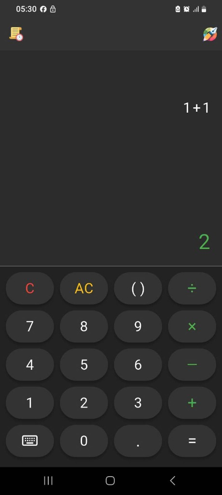
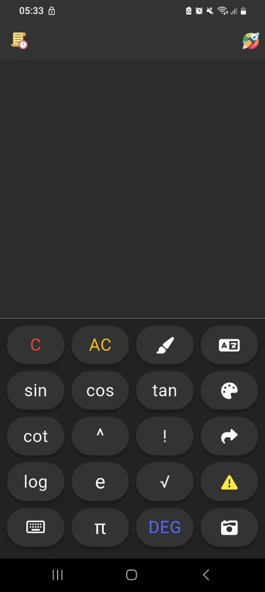
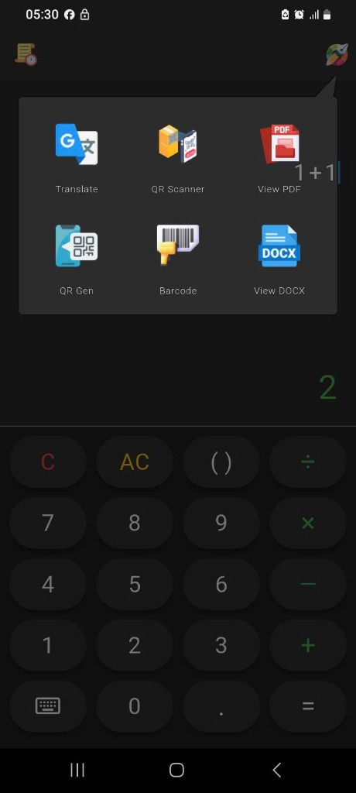
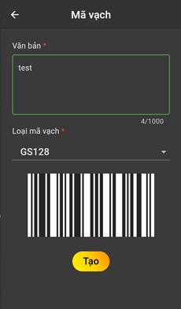
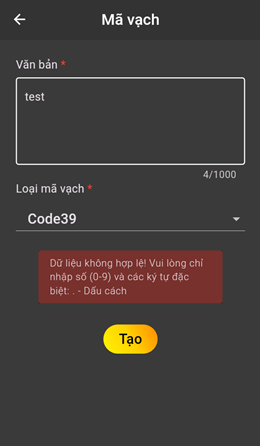
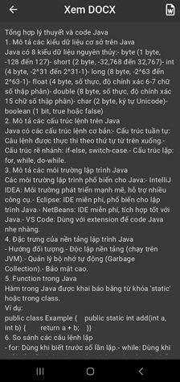

# Smartor — Ứng dụng máy tính thông minh đa năng


> Smart, Powerful, and Convenient Calculator — gộp nhiều công cụ thiết yếu vào một ứng dụng di động duy nhất.

## Mục lục

- [Giới thiệu dự án](#giới-thiệu-dự-án)
- [Chức năng chính](#chức-năng-chính)
- [Công nghệ sử dụng](#công-nghệ-sử-dụng)
- [Kiến trúc hệ thống](#kiến-trúc-hệ-thống)
- [Giao diện hệ thống](#giao-diện-hệ-thống)
- [Hướng dẫn cài đặt](#hướng-dẫn-cài-đặt)
- [Hướng dẫn chạy chương trình](#hướng-dẫn-chạy-chương-trình)
- [Kết quả đạt được](#kết-quả-đạt-được)
- [Hạn chế hiện tại](#hạn-chế-hiện-tại)
- [Hướng phát triển trong tương lai](#hướng-phát-triển-trong-tương-lai)
- [Tác giả](#tác-giả)

## Giới thiệu dự án

**Calc Pro** là ứng dụng di động đa năng được xây dựng bằng Flutter, tích hợp nhiều công cụ thường dùng hằng ngày vào một nền tảng thống nhất: máy tính (cơ bản và khoa học), đọc tài liệu PDF/DOCX, nhận dạng văn bản từ ảnh (OCR) kèm dịch thuật, cùng quét và tạo mã QR/Barcode.

**Bài toán giải quyết:** Người dùng thường phải cài đặt và chuyển đổi qua lại giữa nhiều ứng dụng rời rạc để tính toán, đọc tài liệu, dịch văn bản hay xử lý mã QR. Điều này gây tốn thời gian, dung lượng và làm gián đoạn luồng công việc. Calc Pro hợp nhất các nhu cầu đó trong một ứng dụng nhẹ, giao diện nhất quán, hỗ trợ đa ngôn ngữ và hoạt động tốt trên thiết bị cấu hình phổ thông.

**Đối tượng người dùng:** học sinh – sinh viên, nhân viên văn phòng, người kinh doanh và người dùng phổ thông cần một bộ công cụ tiện ích gọn nhẹ.

## Chức năng chính

- **Máy tính:** phép tính cơ bản và khoa học (lũy thừa, logarit, căn, giai thừa, lượng giác `sin/cos/tan/cot`, hằng số `π`, `e`), hỗ trợ chế độ độ/radian và định dạng số theo locale.
- **Lịch sử tính toán:** lưu, xem lại và xóa lịch sử các phép tính.
- **Đọc tài liệu:** mở và xem tệp **PDF** và **DOCX** ngay trong ứng dụng.
- **OCR và dịch thuật:** nhận dạng văn bản từ ảnh/camera rồi dịch sang ngôn ngữ đích.
- **Mã QR / Barcode:** quét mã từ camera, tạo mã QR và nhiều định dạng barcode (Code39, GS128…), kèm kiểm tra dữ liệu đầu vào hợp lệ.
- **Cá nhân hóa:** tùy chỉnh **giao diện (theme)** và **đa ngôn ngữ** với 40 ngôn ngữ.
- **Gói Premium:** loại bỏ quảng cáo thông qua mua trong ứng dụng (in‑app purchase).

## Công nghệ sử dụng

| Hạng mục | Công nghệ |
|---|---|
| Ngôn ngữ / Framework | Dart, Flutter (SDK ^3.6.2) |
| Quản lý trạng thái | `flutter_bloc` (BLoC/Cubit), `equatable` |
| Dependency Injection | `get_it` |
| Lưu trữ cục bộ | `isar`, `shared_preferences` |
| Tính toán biểu thức | `expressions` |
| OCR / Dịch thuật | `google_vision`, `translator` |
| Xử lý ảnh & camera | `camera`, `image_picker`, `image` |
| QR / Barcode | `qr_flutter`, `qr_code_scanner_plus`, `barcode_widget` |
| Đọc tài liệu | `flutter_pdfview`, `docx_viewer` |
| Đa ngôn ngữ (i18n) | `intl`, `flutter_localizations` (ARB, 40 ngôn ngữ) |
| Giao diện responsive | `flutter_screenutil`, `lottie`, `shimmer` |
| Kiếm tiền | `flutter_ads_plugin` (quảng cáo), `iap_quick` (in‑app purchase) |

## Kiến trúc hệ thống

Ứng dụng tổ chức theo hướng phân lớp (layered) kết hợp mẫu **BLoC** cho quản lý trạng thái và **get_it** cho dependency injection. Luồng dữ liệu một chiều, tách biệt giao diện khỏi logic nghiệp vụ:

```
UI (screens/widgets) → BLoC/Cubit → UseCase → Repository → Data source (Isar / SharedPreferences / API)
```

Cấu trúc thư mục `lib/` phản ánh các tầng: `ui/` (màn hình, widget, router) · `logic/` (blocs, cubits) · `data/` (models, repositories, usecase) · `core/` (theme, i18n, DI, hằng số).

> Lưu ý: mã nguồn hiện tại lưu trữ và xử lý **cục bộ** (Isar + SharedPreferences); phần đồng bộ đám mây/backend không xác định được từ mã nguồn hiện tại.

## Giao diện hệ thống

> Ảnh chụp từ ứng dụng thực tế và tài liệu đồ án.

**Màn hình máy tính**



Giao diện máy tính nền tối, nhập biểu thức ở trên và kết quả được tính hiển thị tức thời bên dưới.

**Bàn phím khoa học**



Chế độ bàn phím nâng cao với các hàm lượng giác (sin, cos, tan, cot), lũy thừa, căn, giai thừa và hằng số π, e, kèm công tắc DEG/RAD.

**Menu công cụ**



Bảng truy cập nhanh các công cụ tích hợp: Dịch (OCR), Quét QR, Xem PDF, Tạo QR, Mã vạch và Xem DOCX.

**Tạo mã vạch (Barcode)**



Người dùng nhập nội dung, chọn loại mã vạch và sinh mã ngay trên màn hình.

**Kiểm tra dữ liệu đầu vào**



Hệ thống xác thực dữ liệu theo từng loại mã và hiển thị thông báo lỗi rõ ràng khi đầu vào không hợp lệ.

**Trình đọc tài liệu DOCX**



Mở và hiển thị nội dung tệp DOCX trực tiếp trong ứng dụng, hỗ trợ cuộn và đọc liền mạch.

**Màn hình đăng nhập (phiên bản trước)**


Màn hình đăng nhập bằng Google ở phiên bản tích hợp Firebase trước đây; phiên bản hiện tại đã chuyển sang chạy hoàn toàn cục bộ nên không còn bước đăng nhập.

## Hướng dẫn cài đặt

Yêu cầu: đã cài đặt [Flutter SDK](https://docs.flutter.dev/get-started/install) (Dart SDK ^3.6.2) và một thiết bị/emulator Android hoặc iOS.

```bash
# 1. Clone dự án
git clone <repository-url>
cd calc_pro

# 2. Cài đặt dependencies
flutter pub get

# 3. Sinh mã cho Isar và bản dịch (nếu cần)
dart run build_runner build --delete-conflicting-outputs
```

## Hướng dẫn chạy chương trình

```bash
# Chạy ở chế độ debug
flutter run

# Build bản phát hành Android
flutter build apk --release
```

## Kết quả đạt được

- Hợp nhất 5 nhóm công cụ (máy tính, đọc tài liệu, OCR, dịch thuật, QR/Barcode) trong một ứng dụng duy nhất.
- Máy tính khoa học xử lý được biểu thức phức tạp với lượng giác, lũy thừa, logarit và giai thừa.
- Hỗ trợ **đa ngôn ngữ với 40 ngôn ngữ** và tùy biến giao diện theo chủ đề.
- Áp dụng kiến trúc phân lớp + BLoC giúp mã nguồn rõ ràng, dễ mở rộng và bảo trì.

## Hạn chế hiện tại

- Lưu trữ ở mức cục bộ; chưa có đồng bộ dữ liệu giữa nhiều thiết bị từ mã nguồn hiện tại.
- Chất lượng OCR và dịch thuật phụ thuộc vào chất lượng ảnh đầu vào và dịch vụ bên thứ ba.

## Hướng phát triển trong tương lai

- Bổ sung đồng bộ dữ liệu/đăng nhập tài khoản trên nền tảng đám mây.
- Mở rộng định dạng tài liệu (TXT, RTF, EPUB) và công cụ chú thích.
- Cải thiện độ chính xác OCR và hỗ trợ dịch ngoại tuyến.
- Hoàn thiện trải nghiệm quét mã QR và phát hành lên Google Play Store.

# Smartor

Developed by Lê Triệu Duy.

Licensed under GPL-3.0.
